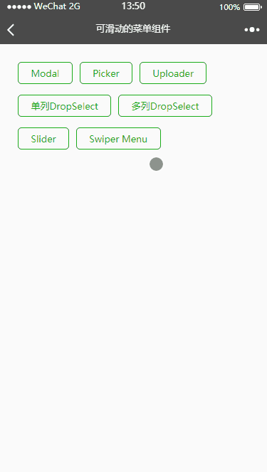

## 可滑动菜单组件说明
更新时间：2018-01-03



### 一、用法
1. 在page.json中设置
    ```json
    {
      "usingComponents": {
        "cpnt-swiper-menu": "../../components/cpntSwiperMenu/cpntSwiperMenu"
      }
    }
    ```

2. 在wxml中使用
    ```html
    <cpnt-swiper-menu menu-width="200">
        <view slot="menu">1</view>
        <view slot="content">2</view>
    </cpnt-swiper-menu>
    ```

### 二、属性说明
| 属性名       | 类型     |默认值      |描述                             |有效值      |
|:----------- |:-------- |:---------:|:------------------------------- |:--------- |
| menuWidth   | Number   |16         |菜单部分宽度                      |           |
| threshold   | Number   |40         |滑动长度达到临界值时呼出菜单        |           |

### 三、特殊说明
1. 组件使用了scroll-view，所以原生的onPullDownRefresh和onReachBottom将失效。
2. 组件传入了两个slot标签，其样式会受组件内部和外部样式影响。
3. scroll-view的动画过度会有些卡顿。