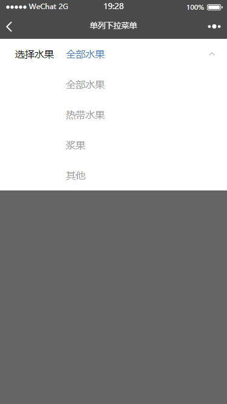
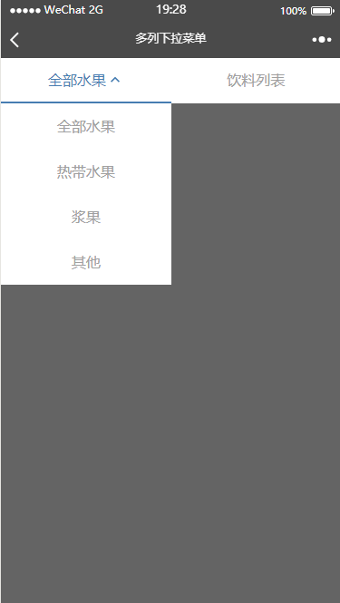

## DropSelect 下拉列表组件说明  
更新时间：2018-03-09

 

该组件有两个类型：单排（single） 和 多排（multi）。 

### 一、用法
1. 在wxml中引入模板
    ```html
    <import src="../../components/dropSelect/dropSelect.wxml"/>
    <template wx:if="{{dropSelect}}" is="dropSelect" data="{{...dropSelect}}"/>
    ```

2. 在wxss中引入样式
    ```scss
    @import '../../components/dropSelect/dropSelect.wxss';
    ```

3. 在js中引入和使用
- 单列
    ```javascript
    import DropSelect from '../../components/dropSelect/dropSelect'
    Page({
     onLoad () {   
       const self = this
       const dropSelectCpnt = new DropSelect(self)
       dropSelectCpnt.init({
         mode: 'single',
         title: '选择水果',
         options: {   
           name: 'fruits',
           data: [
             {id: 0, name: '全部水果'},
             {id: 1, name: '热带水果'},
             {id: 2, name: '浆果'},
             {id: 3, name: '其他'}
           ]
         },
         afterSelect: (selected) => {   
           console.log(selected)
           self.setData({
             result: selected.name
           })
         }  
       })
     }
    })
    ```
- 多列
    ```javascript
    import DropSelect from '../../components/dropSelect/dropSelect'
    Page({
      onLoad () {
        const self = this
        const dropSelectCpnt = new DropSelect(self)
        dropSelectCpnt.init({
          mode: 'multi',
          options: [
            {
              name: 'status',
              data: [
                {id: 0, name: '全部水果'},
                {id: 1, name: '热带水果'},
                {id: 2, name: '浆果'},
                {id: 3, name: '其他'}
              ]
            }, {
              name: 'fruits',
              data: [{id: -1, name: '饮料列表'}]
            }
          ],
          afterSelect (selected) {
            console.log(selected)
            self.setData({
              result: selected.name
            })
          }
        })
      }
    })
    ```
    
### 二、组件方法说明
1. constructor  
   方法说明：构造方法，初始化组件数据  
   场景：通过关键字new创建一个实例时调用。
        
   P 1：Object scope  
   说明：使用组件的Page的作用域。  
   P 2：Json config  
   说明：配置项。
   
2. getSelected  
   方法说明：返回选择内容函数
   
### 三、配置项说明
- 单列config说明

| Param Name  | Type            |Required |Description                         | e.g.     |
|:----------- |:--------------- |:-------:|:---------------------------------- |:-------- |
| `title`     | String          |N        |菜单label，默认：'请选择'              | |
| mode        | String          |`Y`      |菜单模式：single                      | |
| `options`   | `Object`        |`Y`      |列表数据                             |{<br>　name: '',<br>　data: [{id: 1, name: 'item1'}]<br>} |
| `active`    | `String/Number` |N        |默认选择的项，若为String相当于placehoder |'请选择喜欢的水果'/1    |
| afterSelect | Function        |N        |选择后的回调                           |         |   

- 多列config说明

| Param Name  | Type          |Required |Description           | e.g.     |
|:----------- |:------------- |:-------:|:-------------------- |:-------- |
| mode        | String        |`Y`      |菜单模式：multi         |     |
| `options`   | `ObjectArray` |`Y`      |列表数据                |[<br>　{<br>　　name: '',<br>　　active: 0,<br>　　data: [{id: 1, name: 'item1'}<br>　}<br>]     |
| `active`    | `Number`      |N        |默认选择的列，默认：第一列 |    |
| afterSelect | Function      |N        |选择后的回调             |         |   

- 单列options项说明  
若是single模式，options为对象；  
若是multi模式，options为对象数组。

| Param Name | Type        |Required |Description             | e.g.     |
|:---------- |:----------- |:-------:|:---------------------- |:-------- |
| name       | string      |N        |作为菜单的id标记          | |
| data       | objectArray |`Y`      |菜单列表数据，格式如示例    |[{<br>　id: -1,<br>　name: '列表1'<br>}] |
| active     | Number      |N        |默认选择项的下标，`仅multi模式下有效`，不填为当列的第一项| |
